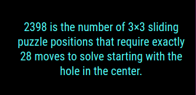

## MMM-Numbers

* All things numbers.

*  Well, maybe not all. :^)

## Four types of returns to choose from. All related to numbers

* Math
* Year
* Date
* Trivia

## Example



## Installation

* `git clone https://github.com/mykle1/MMM-Numbers` into the `~/MagicMirror/modules` directory.

* No API key needed! No Dependencies! No kidding!

## Config.js entry and options
```
{
   disabled: false,
 module: "MMM-Numbers",
 position: "bottom right",
 config: {
   type: "math",                        // math, trivia, date, year
   useHeader: false,                    // false if you don't want a header
   header: "",                          // Any text you want. useHeader must be true
   maxWidth: "300px",
   updateInterval: 5 * 60 * 1000,
 }
},
```
